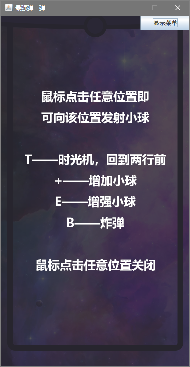

# 最强弹一弹游戏

## 游戏操作方式

- 进入界面，点击开始游戏，即可开始游戏

- 开始游戏后，界面左上角为当前分数与当前球数，右上角为菜单按钮，其余部分为游戏屏幕
- 游戏屏幕可分为边框内与边框外，球不会运动到边框外

- 鼠标点击即可发球，程序自动计算并向鼠标位置发射小球，其余流程与大作业要求相同

- 点击右上角菜单按钮后，会出现菜单面板，上面可以点选重新开始游戏，或显示操作提示
- 点选重新开始游戏后，游戏会重新开始

- 点选操作提示后，会显示操作提示，单击鼠标即可退出
- 在游戏界面点击鼠标右键也可打开操作提示

- 如果几何体到达顶部，游戏结束，会弹出游戏结束界面，显示最终得分，此时单击也可以重新开始游戏

## 架构设计

- 具体可参见 API 文档，API 文档在提交文件的 `doc` 文件夹下
- 类图也附在 API 文档内，当然下面将详细解释架构设计

- 上面是整个项目的类图

主要的类为 `GeometryObejct` 类，所有的几何体与道具抽象类 `ToolBox` 均继承于此，其定义了几何体的行为，绘制方法，碰撞方法等

- 上图即为 `geometryobejct` 包的类图，通过这种继承关系，可以增强代码的复用性，也提升程序的可修改性
- `GameUpdater` 控制程序时钟，使用高分辨率的系统时钟作为更新触发器，也实现了将Swing组件与Graphics共同主动渲染
- `GameData` 存储游戏数据，这里定义了整个游戏流程
- `bgm` 包处理背景音乐
- `view` 包定义了大部分界面，处理了界面逻辑
- `main` 包是程序运行的入口
- `utilities` 本意是作为功能函数，但这里用做一些全局定义的字体等，减小新建对象带来的开销
- 通过设计资源文件夹的方式，将资源文件与代码文件分开，提升了代码的观感
- 本设计还有几处有趣之处，将在后面的亮点章节说明

## 实现的提高部分

- [x] 使用双缓冲绘图避免画面闪烁
- [x] 实现背景音乐
- [x] 优化程序提高效率，在有许多几何体时，依旧保持帧率流畅，如下图

## 亮点

- 双缓冲绘图参考了<https://www.jamesgames.org/resources/double_buffer/double_buffering_and_active_rendering.html>，可能有部分代码比较相似，特此声明。除此以外，其余部分代码均为自己写成。
- 当小球在几何体上速度几乎为0时，将会弹起，以避免小球在几何体上停留过长时间
- 小球在第一次发生撞击前不受重力影响，指哪打哪，在第一次撞击后，小球会受重力影响，呈抛物线轨迹运动
- 考虑 Insets，将窗体大小设置为真实值，并且不可更改
